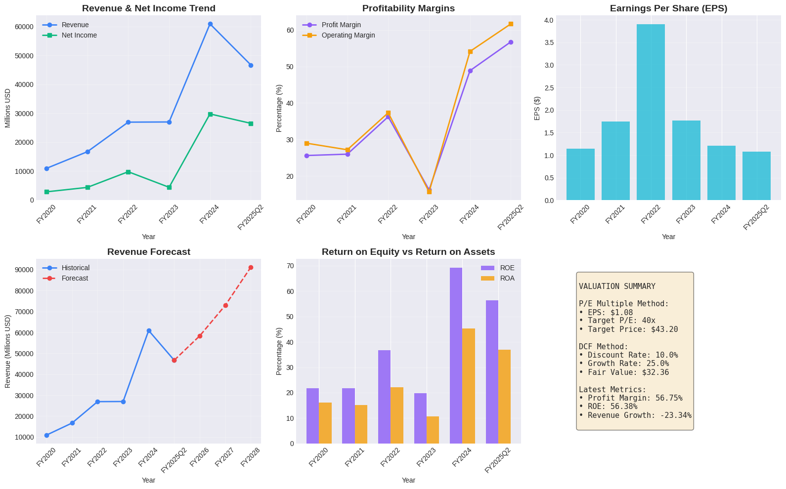

# NVIDIA Financial Modeling

This project presents an **end-to-end financial analysis and valuation** of **NVIDIA Corporation (NVDA)**, demonstrating core competencies in financial modeling, data analysis, and visualization using Python.

---

## Overview

The project focuses on analyzing NVIDIA’s financial performance, forecasting future revenues, and estimating intrinsic value using **Discounted Cash Flow (DCF)** and **comparable multiples** methods.

---

## Objectives

* Structure and clean financial data using **Pandas**
* Compute key **profitability and efficiency ratios**
* Build a **revenue forecast model** assuming a 25% CAGR
* Perform **valuation analysis** using DCF and multiples
* Visualize key insights with **Matplotlib/Seaborn**

---

## Key Metrics

| Metric                   | Value |
| :----------------------- | :---- |
| **Profit Margin**        | 57%   |
| **ROE**                  | 56%   |
| **Revenue Growth (YoY)** | 56%   |

---

## Methodology

1. **Data Engineering:** Financial data imported, cleaned, and structured using `pandas`.
2. **Exploratory Analysis:** Trend and ratio analysis across income statement and balance sheet items.
3. **Forecasting:** Revenue projected at **25% CAGR** based on historical performance.
4. **Valuation:** Intrinsic value estimated through **DCF** and **comparable company** analysis.
5. **Visualization:** Created executive-style dashboards for communicating insights.

---

## Tools & Libraries

* Python (Pandas, NumPy, Matplotlib, Seaborn)
* Financial Modeling & Valuation techniques
* Excel (for sensitivity checks)

---

## Results

* NVIDIA’s financial performance remains strong, with exceptional margins and growth rates.
* The DCF model indicates sustained intrinsic value aligned with long-term growth expectations.
* Visual analytics highlight NVIDIA’s superior capital efficiency relative to peers.


---

## Skills Demonstrated

* Financial Data Analysis
* Quantitative Modeling
* Corporate Valuation
* Data Visualization
* Analytical Communication

---

## Repository Structure

```
NVIDIA-Financial-Modeling/
│
├── data/                     # Raw and cleaned financial datasets
├── notebooks/                # Jupyter notebooks for analysis
├── visuals/                  # Generated charts and plots
├── models/                   # DCF and multiples valuation models
├── README.md                 # Project overview
└── requirements.txt          # Dependencies
```
